# Git Tutorial

## Key Git Terminology

* Repository contains files, history, config managed by Git
* Three States of Git
  * Working directory
  * Staging area - pre-commit holding area
  * Commit - Git Repository (history)
* Remote repository (GitHub)
* Master branch
  * Time-line that contains your changes

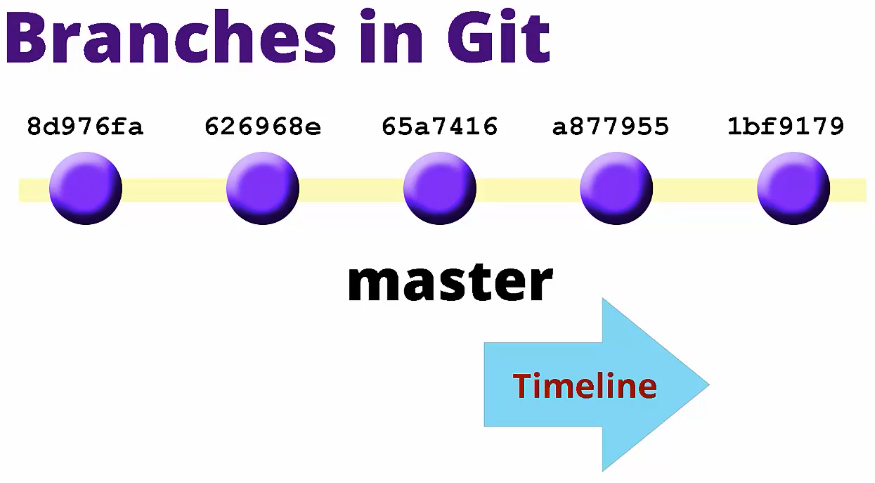

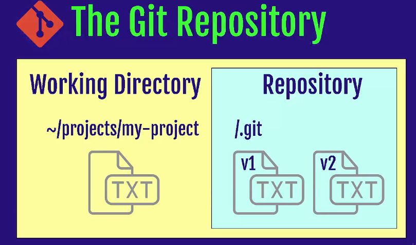

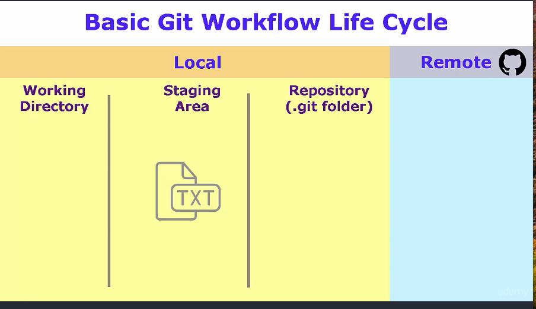


## Quick Start: Starting with GitHub and Project Setup

* In order to show the entire Git workflow, we will create a repository at GitHub
  * We will make copy of that repository in our local system and synchronize our local changes with it

* Create your repository at GitHub
* Open your terminal and clone your repository
  * ```pwd```: To check the current working directory
  * ```mkdir projects```: Lets make a projects folder
  * ```cd projects```: Navigate to the folder
  * ```git version```: If git responds with a version number, it means it is installed
  * ```git config --global user.name "Daniel"```
  * ```git config --global user.email "danielmapar@gmail.com"```
  * ```git config --global --list```: This should list the credentials you just inputed
  * ```git clone https://github.com/danielmapar/github-demo```: This will clone the repository to your current working directory
  * ```git status```: Git will let us know that we are in the ```master``` branch, which is the default branch by convention
    * Also, Git already make a link for us to the remote repository ```origin/master```. It is called ```origin``` and it points to the GitHub repository.
  * We use the ```git status``` to see if there are changes done to the local repository.
  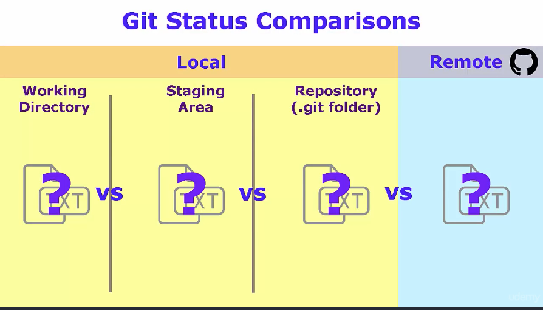
  * Now that we have a local repository, lets create a new file: ```echo "Test Quick Start demo" >> start.txt```
  * ```ls```: Now we can see the new file inside our repository  
  * ```cat start.txt```: Shows the content of the file
  * ```git status```: Git will point out that we have an untracked file, that means that this file is in our Working directory.
  * To add the file to the Staging area, we need to tell Git to do it: ```git add start.txt```
  * ```git status```: Now git will show our ```start.txt``` file as "Changes to be committed"
  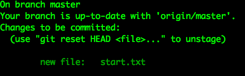
  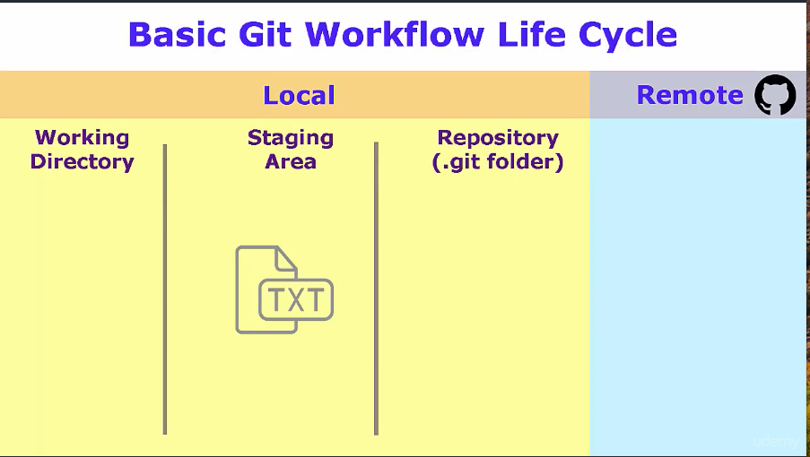
  * ```git commit -m "Adding start text file"```: Lets commit this file to the local repository
  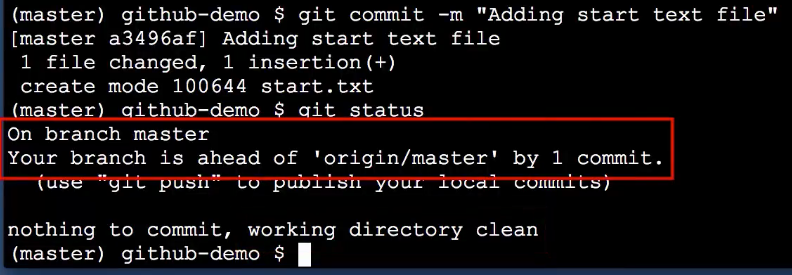
  * Now Git is telling us that our local branch is ahead of our remote one located in the GitHub repository. Also, that our working directory is clean
  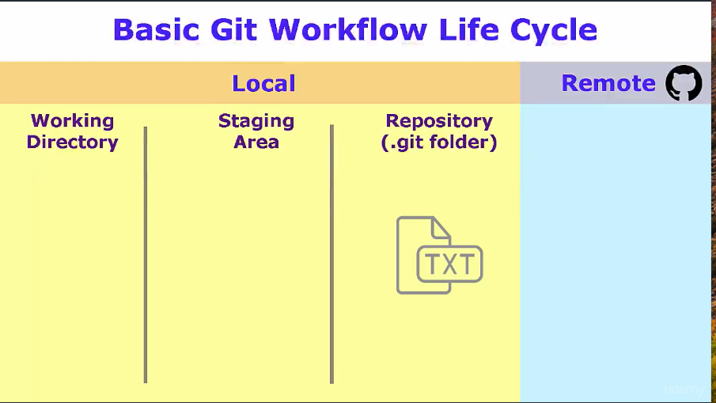
  * IMPORTANT: Our file is not yet on GitHub (our remote repository)
  * ```git push origin master```: We are telling git to push to our remote repository ```origin``` at a branch called ```master```

## Setup Text Editor

* Lets link Git with the Atom Text Editor
* ```git config --global core.editor "atom --wait"```
* ```git config --global -e```: Git will open the git config file at the user level using the default text editor

## Git Basics Overview - Core Git Commands

* Starting a Project
  * Fresh (no source yet)
  * Existing source locally
  * GitHub project (Fork and clone)
* Basic workflow (add, commit, push, pull)
* Working with Files (rename, move & delete)
* Ignoring Unwanted Files

## Initialize a new Project

* ```git init fresh-project```: Creates a new local repository within the ```fresh-project``` folder
* ```ls -al```: `-a` list all files and folders, and `-l` to list in the file format
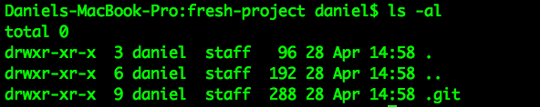
* `.git`: Where the actual git repository lives
* `git status`: That will tell us that we are in the `master` branch, which is the default one
* ```atom hipster.txt```: Lets create a new file inside the repository
* ```git status```: Git tells me that we have some untracked files. Having said that, for Git to start tracking this file (staging area), we need to run a ```git add hipster.txt```
  * This file is not in the staging area
* ```git commit```: Git will invoke our default editor in order for us to write our commit message
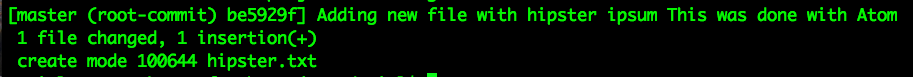
  * Git will let us know this was our first commit for this repository aka ```root-commit```
* ```rm -rf fresh-project```: Lets delete the git repository

## Adding Git to an Existing Project

* Download a project initializer from: http://www.initializr.com/
* ```unzip ~/Downloads/initializr.zip```
* ```mv initializr ~/Desktop/workspace/web-project```
* ```cd ~/Desktop/workspace/web-project```
* ```git init```: This will initialize a new repository using the current folder as the current directory
* ```git add .```: To add all files in the working area to the staging area
* ```git status```: Nothing else to commit
* ```rm -rf .git```: If we remove the ```.git``` folder, the project will no longer be tracked by git
* ```rm -rf ~/Desktop/workspace/web-project```: Lets remove this project

## Fork and Clone

* Open the url: https://github.com/scm-ninja/starter-web
* Click on Fork
* Copy the url of your new forked repository: https://github.com/danielmapar/starter-web.git
* ```cd ~/Desktop/workspace```
* ```git clone https://github.com/danielmapar/starter-web.git```
* ```ls```: Git created a folder based on the repository we just cloned
* ```git status```: We are on branch master, and our branch is up to date with ```origin/master```. ```origin``` is our remote reference

## Configure terminal to output branch information

* Follow the instructions at: https://github.com/jimeh/git-aware-prompt

## Basic Workflow (Add, Commit, Push)

* ```atom hipster.txt```: Create a new file inside the repository
* ```git add hipster.txt```: Add new file to staging area
* ```git commit -m "New file"```: Move file from staging area to the actual repository
* ```git pull origin master```: That command will check the remote repository to check if our local repository is up to date
* ```git push origin master```: Pushing to the remote repository

## Tracked Files

* ```atom ~/.gitconfig```: Here you are able to change your user specific git settings
* ```git commit -am "Adding more ipsum text"```: This command will let us add and create a commit at the same time
  * ```-a``` / ```--all```: Tell the command to automatically stage files that have been modified and deleted, but new files you have not told Git about are not affected.
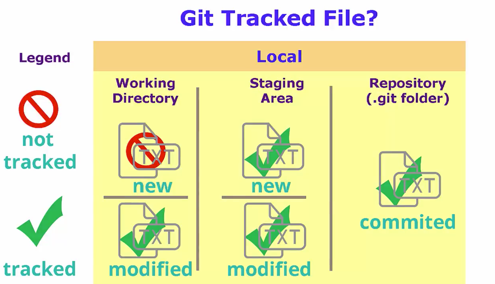
* A tracked file is any file that git is aware of and tracking actively.
  * Any file that has already been committed to the git repository, or any file that has been added to the git index or the git staging area
  * ```git ls-files```: This gives me a list of all the files that git is tracking in the current repository
* Lets say I create a new file inside a repository by running ```touch new_file```.
* ```git ls-files```: You will notice the file is not listed, because this file still in the Working Directory as a new file
* By running ```git add new_file``` git will add this to the git index (Staging Area) and we should be able to track it with ```git ls-files```
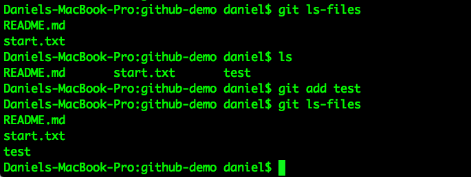
* IMPORTANT: In case you create a new file, executes ```git add new_file``` and edit this file afterwards, the new file changes will be on the Working Directory, and the previous ones will be in the Staging Area

## Recursive Add

* ```git add .```: Add all the files recursively from this point forward. That include a complex folder structure

## Backing Out Changes

* ```touch level1.txt```: Create a new file
* ```echo "123" > level1.txt```: Add some content to it
* ```git add level1.txt```: Add a file to the Staging Area
* ```git commit```: Commit those changes
* ```echo "321" > level1.txt```: Change file content
* ```git add level1.txt```: Add a file to the Staging Area
* ```git reset HEAD level1.txt```: That will unstage the file, sending it back to the Working Directory
* ```git checkout -- level1.txt```: That will undo any changes done on the Working Directory for this file

## Renaming Files

* We could rename the file by using the OS ```mv``` command, a GUI, but we will use ```git mv``` command.
* ```git mv level1.txt level2.txt```: Git will rename the file at the OS level, and if we do a ```git status``` git has staged the fact the rename is taking place.
* ```git commit -m "Renaming level1 file"```
* ```mv```: If you rename using a bash command, git sees that as two operations: deletes the file and creates a new file
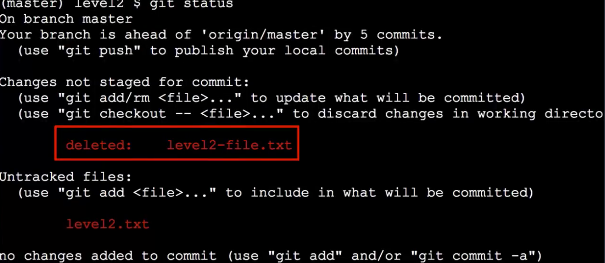
* ```git add -A```: Recursively add any changes, but will also update any files that have been renamed, moved, or deleted.
  * ```git status```: Git sees we renamed the file
  * In case you need to add just a specific file run: ```git add level1``` and ```git add -u``` to let git know we are renaming a file

## Deleting Files

* ``` touch brand_new_file```: Creates a new file
* ```rm brand_new_file```: Run the OS bash command whenever the file is untracked by git
* ```git rm level1.txt```: Removes a file that is being tracked by git, and puts it in the Staging Area
* ```git add -A```: Remember that this command will stage renames/deletion of files

## History

* ```git help log```: Bring options for the log command
* ```git log```: Shows a log of all commits done in the repository
* ```git log --abbrev-commit```: Commit id is shorten (6-7 chars are enough to identify a commit for the most part)
* ```git log --oneline --graph --decorate```
  * ```--oneline```: Compress our entries in one line
  * ```--graph```: ASC graph depicting the branching graph
  * ```--decorate```: Will add anything that annotates our commits
  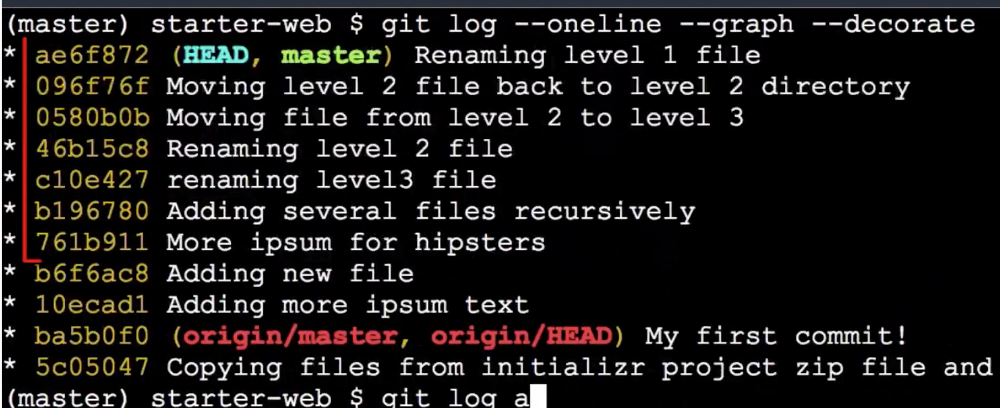
* ```git log -- file.txt```: Commits related to file.txt
* ```git show $commitid```: Shows commit details

## Alias

* ```git config --global alias.hist "log --all --graph --decorate --oneline"```: Add a new git command called ```hist```
* Alias are stores inside ```.gitconfig```

## Ignore Files

* ```.gitignore```: Create a file to list banned files
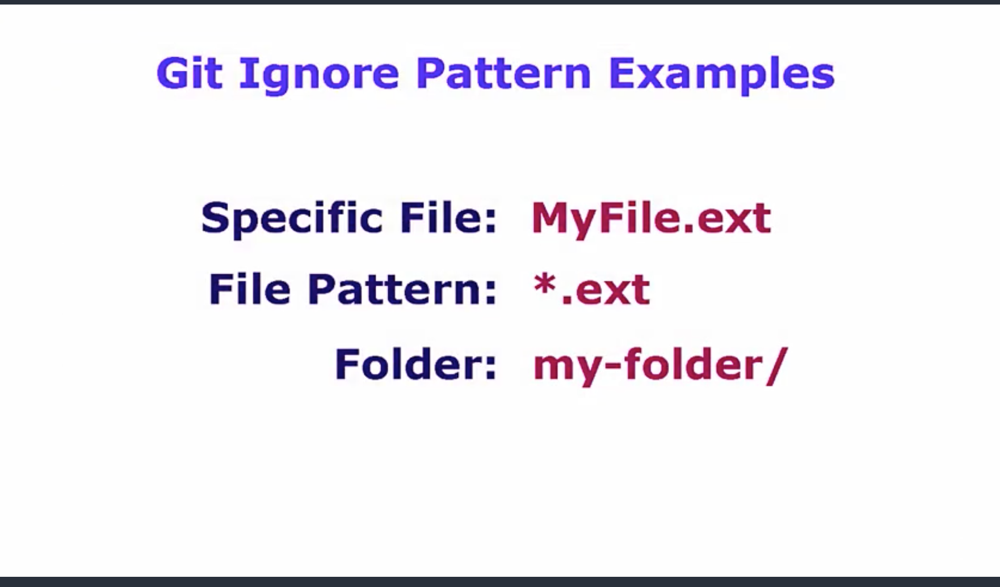

## Merging Tools

* Install P4Merge: https://www.perforce.com/downloads/visual-merge-tool

* ```git config --global diff.tool p4merge```
* ```git config --global difftool.p4merge.path /Applications/p4merge.app/Contents/MacOS/p4merge```
* ```git config --global difftool.prompt false```
* ```git config --global merge.tool p4merge```
* ```git config --global mergetool.p4merge.path /Applications/p4merge.app/Contents/MacOS/p4merge```
* ```git config --global mergetool.prompt false```
* ```git config --global --list```
* ```git config --global --list -e```: Open file using Atom

## Comparisons

* Working Dir vs Staging Area: ```git diff```
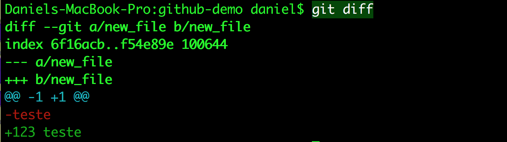
  * ```git difftool```: In case you have a visual diff tool configured (like P4)
  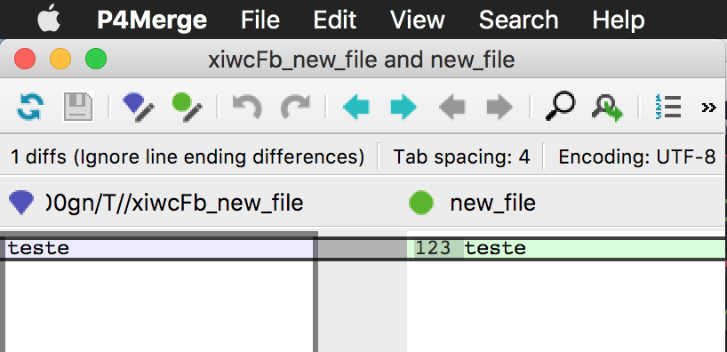
  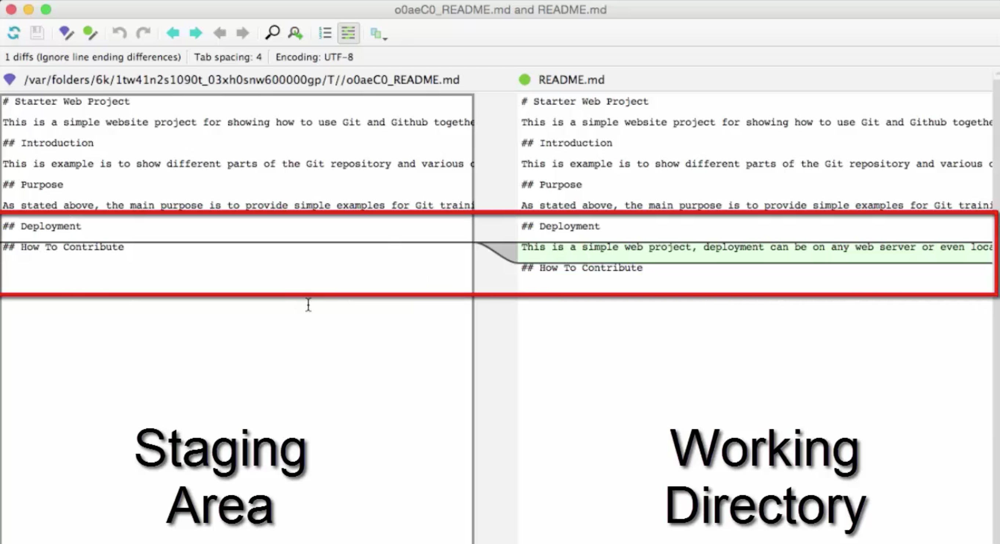

* Working Dir vs Local Repository (last commit): ```git diff HEAD```

* Staging Dir vs Local Repository (last commit): ```git diff --staged HEAD```
